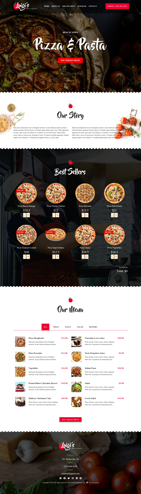

# Luigi Pizza Company Website 🍕

A modern **React.js website** built for **Luigi Pizza** to present the company’s brand, products, and story.  
The site includes a dynamic landing page, best seller highlights, full menu with add-ons, company profile pages, and a blog section — all wrapped in a responsive design.

---

<p align="center">
   <a href="https://raw.githubusercontent.com/nithasp/luigi-pizza-new/master/screenshots/sc1.jpg" target="_blank">
    
  </a>
</p>

---

## ✨ Features

- **Landing Page** with slider and company highlights
- **Pizza Menu & Add-ons** with structured JSON data
- **Best Seller Showcase** for popular pizzas and combos
- **Interactive Calculator** for pricing or add-on estimation
- **About Us & Contact Pages** to present company profile and connect with customers
- **Blog Section** for promotions and updates
- **Responsive Design** with custom CSS for smooth mobile and desktop experience

---

## 🛠 Tech Stack

- **Frontend Framework:** React.js
- **Language:** JavaScript (ES6)
- **Styling:** Custom CSS (responsive design)
- **Data Handling:** JSON-based mock data

---

## 🚀 Installation

1. Clone the repository:

   ```bash
   git clone https://github.com/nithasp/luigi-pizza-new
   ```

2. Navigate to the project directory:

   ```bash
   cd luigi-pizza-new
   ```

3. Install dependencies:

   ```bash
   npm install
   ```

4. Start the development server:

   ```bash
   npm start
   ```

5. Open your browser at:
   ```
   http://localhost:3000
   ```

---
